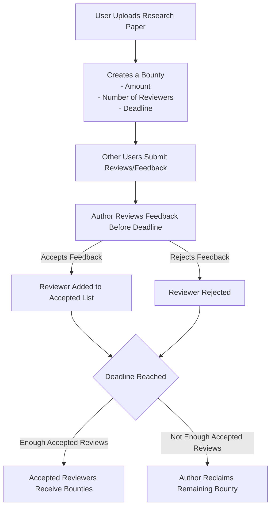
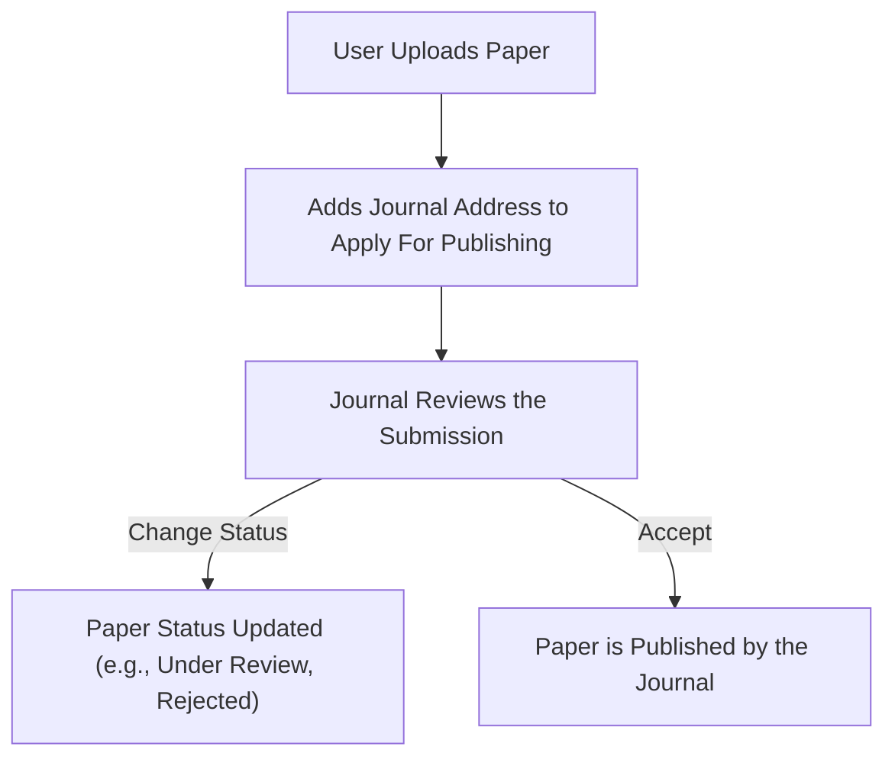

# SageNet: A Web3-Powered Research Platform

A safe, decentralized platform for research enthusiasts to publish papers with proof of ownership, apply for journal publications, offer peer review bounties, and contribute to others’ research. Powered by EDU-CHAIN and assisted by Sagey — your AI agent for fast, related research discovery.

---

## 📘 Table of Contents

- [Understanding the Problem](#understanding-the-problem)
  - [Our Narrative](#our-narrative)
  - [🔎 Issues in the Peer Review System](#-issues-in-the-peer-review-system)
- [🔍 Features](#-features)
- [💰 Fundraising Status](#-fundraising-status)
- [🗺️ Project Roadmap](#️-project-roadmap)
  - [🔧 Technical Roadmap](#-technical-roadmap)
  - [📈 Business & Community Roadmap](#-business--community-roadmap)
- [🧾 What We'll Do With Funds](#-what-well-do-with-funds)
- [User Flows](#user-flows)
  - [Paper Peer Review Flow](#paper-peer-review-flow)
  - [Paper Publishing Flow](#paper-publishing-flow)
- [🧠 Tech Stack](#-tech-stack)
  - [Frontend](#frontend)
  - [Agent](#agent)
  - [Smart Contract](#smart-contract)
- [🚀 Running Locally](#-running-locally)
- [📄 License](#-license)
- [👥 Authors](#-authors)

---

## Understanding the Problem

### Our Narrative ( MUST READ )

Parth (@Par-t) completed our mandatory 6-month industry training through research instead of the more conventional internship route — a rare path due to the lack of **research support in India**. This decision came with several challenges during his work on **Application of Machine Learning in Fiber Optics based intrusion detection and classification systems** and **Aspect based sentiment analysis of reviews in tourism and hospitality sector**:

1. Many professors prioritize **quantity of publication** over **quality** and global standards.
2. The journal submission process is **slow** and **opaque**, often requiring repeated follow-ups.
3. Peer reviews are often done by TAs, resulting in **low-quality feedback** due to a lack of incentives.

### 🔎 Issues in the Peer Review System

#### 1. Lack of Compensation and Recognition for Peer Reviewers

The article **["Who Pays the Price for Peer Review?"](https://www.morressier.com/post/who-pays-the-price-for-peer-review)** highlights a growing concern in academia: peer reviewers are rarely compensated or formally recognized for their contributions.

- This lack of incentive leads to difficulty in sourcing willing reviewers.
- It causes **delays** and compromises the **quality** of feedback.
- The system currently relies on **academic goodwill**, which is increasingly unsustainable given the growing volume of research.

#### 2. Ethical Concerns in Peer Review Practices

In the article **["Peer Review Ghost-Writing, or Do Professors Understand Plagiarism?"](https://forbetterscience.com/2017/07/05/peer-review-ghost-writing-or-do-professors-understand-plagiarism/)**, the author explores unethical practices in the peer review process:

- Senior academics sometimes **delegate** peer review responsibilities to junior staff or students.
- These contributions are often **unacknowledged**, raising serious concerns around **plagiarism**.
- This practice undermines the **transparency and integrity** of peer review in academic publishing.

---

## 🔍 Features

1. **Authorship Tracking with SBTs (ERC721 Tokens)**

   - Receive a Soulbound Token (SBT) on first draft upload.
   - Verifies authorship and combats plagiarism.

2. **Bounty System for Peer Reviews**

   - Offer crypto bounties for quality peer reviews.
   - Smart contracts automate verified review payments.

3. **AI-Powered Research Comparison**

   - Detects plagiarism and finds similar research.
   - Enables better collaboration and prevents duplication.

4. **Decentralized Research Search Engine**

   - Web3-powered, DAO-governed research discovery.
   - Ranks papers fairly — not by SEO or paywalls.

5. **Sagey – Personal AI Research Assistant**

   - Recommends papers and references as you write.
   - Improves literature review and speeds discovery.

6. **Transparent Journal Submission Tracking**
   - Real-time status updates on paper submissions to journals
   - Eliminates the need for constant follow-ups between authors and publishers
   - Clear visibility into each stage of the review process with automated notifications

---

## 💡 Use Cases: Where SageNet Shines

### 1. Global Research Tracking & Discovery

**Problem:** Research is siloed in different journals and platforms, creating redundancy and missed collaboration opportunities.

**SageNet Solution:** Our platform provides:

- Unified discovery across journals and institutions worldwide
- AI-powered similarity detection to connect related research
- Decentralized indexing that isn't limited by paywalls or institutional access

**Real-world Impact:** A PhD student in India can instantly discover and connect with researchers in Europe working on similar problems, avoiding duplicate work and fostering global collaboration.

### 2. Journal Reputation System

**Problem:** Researchers struggle to identify trustworthy journals among predatory publishers.

**SageNet Solution:** Our on-chain reputation system:

- Tracks journal performance metrics transparently
- Enables researcher ratings and reviews of publications
- Creates immutable records of journal publishing history

**Real-world Impact:** A new researcher can confidently submit to journals with proven track records instead of risking their work with exploitative publishers.

### 3. Incentivized Quality Peer Reviews

**Problem:** Traditional peer review lacks incentives, resulting in delayed or superficial feedback.

**SageNet Solution:** Our bounty system:

- Motivates thorough, timely reviews through financial incentives
- Ensures review quality through author verification before payment
- Creates a reputation system for reviewers based on acceptance rate

**Real-world Impact:** A researcher receives five detailed, actionable peer reviews within two weeks instead of waiting months for potentially superficial feedback through traditional channels.

### 4. Transparent Submission Tracking

**Problem:** Researchers waste time and energy with constant follow-ups on submission status.

**SageNet Solution:** Our status tracking system:

- Provides real-time updates on paper progression through review stages
- Sends automated notifications when status changes
- Creates accountability through transparent timelines

**Real-world Impact:** Instead of sending weekly emails asking about paper status, researchers can focus on their next project while receiving clear updates through the platform.

## 🗺️ Project Roadmap

### 🔧 Technical Roadmap

- **Next 2 Months**

  - Launch the **testnet version** with rewritten and **security-audited smart contracts** for:
    - Paper publishing
    - Bounty creation
    - Peer review automation
  - Remodel **Sagey** to dynamically analyze all uploaded papers, enhancing **similarity detection** and **research relevance**.

- **Following 1 Month**

  - Gather feedback from early testnet users.
  - Iterate quickly and fix bugs to improve the platform's performance and usability.

- **Next 3 Months**
  - Build a **fully integrated research paper writing interface**, complete with:
    - Live reference recommendations
    - In-editor AI assistance
    - Versioning and citation tools

### 📈 Business & Community Roadmap

- Connect with our own colleges and expand outreach to **IITs and research clubs** to onboard early users.
- Launch **premium AI-assisted writing tools** as optional upgrades.
- Begin discussions with **academic journals** to:
  - Recognize their reputation levels on-chain.
  - Enable researchers to directly submit applications for publishing.

---

## User Flows

### Paper Peer Review Flow



### Paper Publishing Flow



## 🧾 What We’ll Do With Funds

- 💼 **Sustain Ourselves**: As student builders, the funds will act as a **side income** to allow us to work more consistently and seriously on the project.
- 🧪 **Development Costs**: Pay for essential infrastructure such as cloud compute, smart contract audits, and continuous deployment.
- 🚀 **Growth & Partnerships**: Fuel outreach campaigns, partnership initiatives with universities and journals, and expand community support.
- 🧠 **Product Enhancements**: Invest in building more advanced AI capabilities and onboarding tools for new researchers.

We are open to collaborations, grant opportunities, and accelerator programs that align with our mission to build a fair, decentralized future for research publishing.

---

## 💰 Fundraising Status

We’re currently in the **fundraising phase** to sustain and grow SageNet beyond the hackathon.

Since this project is being built entirely by students — with Parth being a university student and Prakhar still early in his career — any funding would help us continue working full-time on the platform. We are currently seeking **grants, accelerators, and angel support** to push SageNet forward and build it into a sustainable, impactful research ecosystem.

---

## 🧠 Tech Stack

### Frontend

- Next.js (TypeScript)
- Wagmi with Reown Wallet

### Agent

- Python with BM25 Algorithm

### Smart Contract

- Foundry
- Solidity
- OpenZeppelin ERC721

---

## 🚀 Running Locally

1. **Clone the repository**

   ```bash
   git clone https://github.com/prakhar728/SageNet.git && cd SageNet
   ```

2. Install dependencies:

   ```bash
   cd client
   pnpm install
   ```

3. Set up environment variables:

   ```bash
   cp .env.example .env
   ```

   Add the required variables to `.env`

4. Start the development server:
   ```bash
   pnpm run dev
   ```

## 📄 License

This project is licensed under the MIT License - see the [LICENSE](LICENSE) file for details

## 👥 Authors

- [@prakhar728](https://github.com/prakhar728) - UG at IIIT Surat(2024 pass out)
- [@Par-t](https://github.com/Par-t) - UG at IIIT Surat(2024 pass out), Masters at SBU(Computer Science with a concentration in Data Science)
